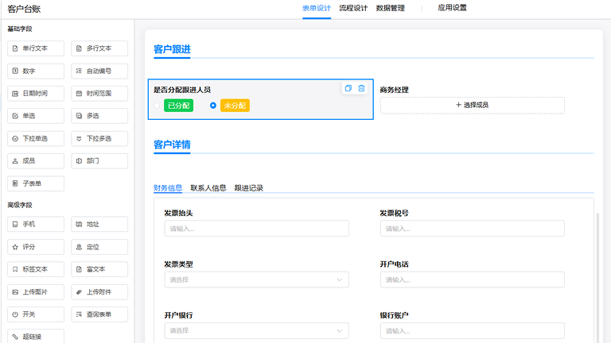
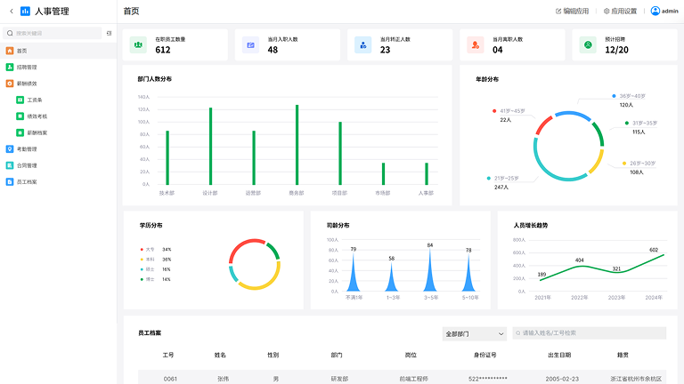
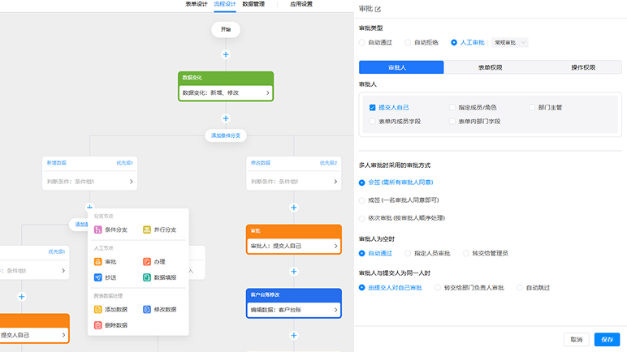
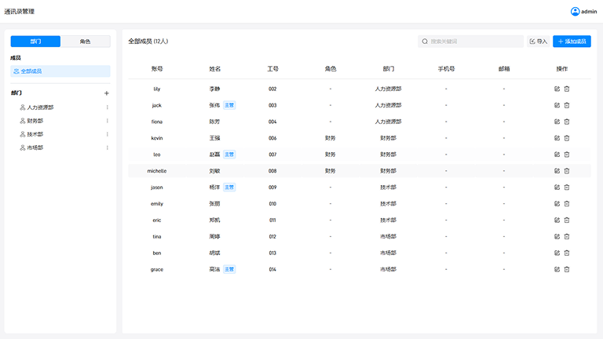
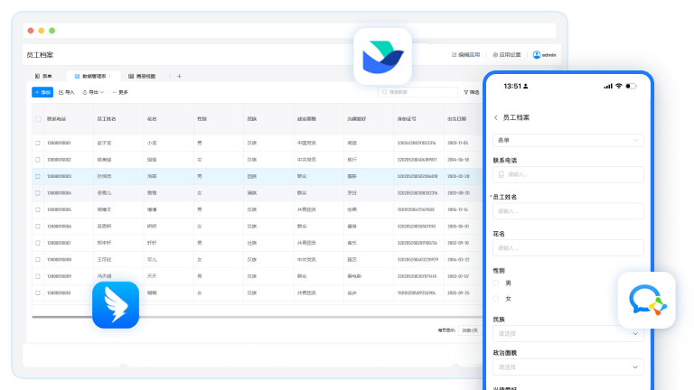

  

  <h1>斑斑AI · Banban AI</h1>
  
私有化部署的 AI 低代码平台

  

    <a href="https://www.banban.work/">官网</a> ·
    <a href="https://www.banban.work/download">免费下载</a> ·
    <a href="https://www.banban.work/docs/">使用教程</a> ·
    <a href="mailto:support@banban.work">联系我们</a>
  

> 让每个企业都能快速实现 AI 数字化。通过自然语言与可视化配置，快速构建表单、流程、看板及企业级业务应用。
>
> Banban AI is a self-hosted, AI-powered low-code platform for building enterprise applications with data kept private and under control.

## 为什么选择斑斑AI

<table>
  <tr>
    <td width="50%"><strong>AI 辅助构建</strong> 用自然语言生成应用、表单、公式和流程，降低业务系统搭建门槛。</td>
    <td width="50%"><strong>数据自主可控</strong> 支持私有化、内网与离线部署，业务数据保存在自己的环境中。</td>
  </tr>
  <tr>
    <td><strong>一站式业务能力</strong> 表单、流程、看板、权限与数据管理统一在一个工作台中完成。</td>
    <td><strong>开放连接能力</strong> 提供 API，并支持钉钉、企业微信等企业系统集成。</td>
  </tr>
</table>

## 核心能力

- **应用生成**：根据业务场景描述，通过AI生成表单字段、页面布局、计算公式和流程逻辑。
- **数据存储**：支持内置数据库、MongoDB 及私有化环境，满足数据自主可控要求。
- **表单与流程**：覆盖多种字段、条件校验、自动提交、审批、分支和跨表数据处理。
- **看板与分析**：提供图表、指标卡、透视表、数据联动和可视化报告能力。
- **权限与集成**：支持应用、页面、字段和数据权限，以及 API、钉钉、企业微信和单点登录。

## 产品界面

<table>
  <tr>
    <td align="center" width="50%">
      
       <strong>业务表单设计</strong>
    </td>
    <td align="center" width="50%">
      
       <strong>业务表单设计</strong>
    </td>
  </tr>
  <tr>
    <td align="center" width="50%">
      
       <strong>数据可视化看板</strong>
    </td>
    <td align="center" width="50%">
      
       <strong>流程自动化引擎</strong>
    </td>
  </tr>
  <tr>
    <td align="center" width="50%">
      
       <strong>权限与组织管理</strong>
    </td>
    <td align="center" width="50%">
      
       <strong>多端适配与协同</strong>
    </td>
  </tr>
</table>

## 开始使用

| 资源 | 入口 |
| --- | --- |
| 产品官网 | [banban.work](https://www.banban.work/) |
| 本地下载 | [下载标准版](https://www.banban.work/download) |
| 使用教程 | [教程文档](https://www.banban.work/docs/) |
| 问答社区 | [加入社区](https://www.banban.work/community/) |
| 视频教程 | [Bilibili](https://space.bilibili.com/3706989515377514) |

标准版免费开放完整 AI 低代码核心能力；复杂场景可联系团队获取专属部署、深度集成与交付服务。

## 联系我们

- Email: [support@banban.work](mailto:support@banban.work)
- 公司：杭州多算科技有限公司
- 官网：[www.banban.work](https://www.banban.work/)
